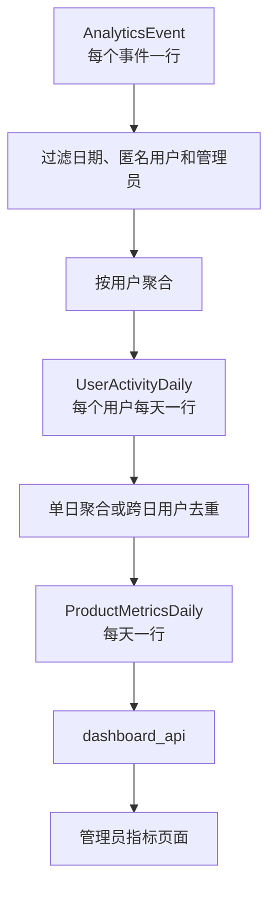
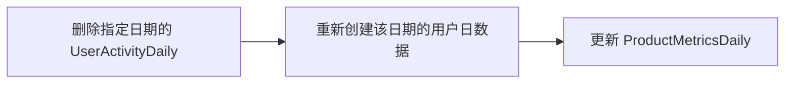
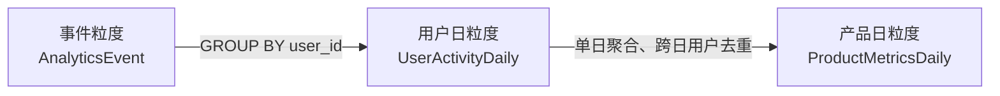

# 从 `AnalyticsEvent` 到论坛日指标

> 本文基于论坛项目中的 `analytics/services.py`，分析原始事件如何转换成用户日汇总和产品日指标。

> [!NOTE]
> **阅读主线：** 原始事件 → 有效事件过滤 → 用户日汇总 → DAU/WAU/MAU 去重 → 产品日指标。

## 快速导航

- [学习目标](#1-学习目标)
- [数据处理链路](#3-数据处理链路)
- [有效活跃事件](#4-有效活跃事件)
- [用户日粒度转换](#7-从事件粒度转换为用户日粒度)
- [DAU 的实际计算](#11-dau-的实际计算)
- [WAU 和 MAU 的窗口去重](#13-wau-和-mau-的窗口去重)
- [当前实现的重要边界](#15-当前实现的重要边界)
- [核心结论](#16-核心结论)

---

## 1. 学习目标

完成本节后，应能回答：

- 哪些事件会被纳入指标计算？
- 原始事件如何转换为用户日粒度？
- 为什么 `UserActivityDaily` 行数不等于 DAU？
- DAU、WAU、MAU 如何去重？
- 为什么需要先汇总，再生成产品日指标？
- 当前实现有哪些重要口径边界？

## 2. 相关文件

- `analytics/services.py`
- `analytics/models.py`
- `analytics/views.py`

## 3. 数据处理链路



| 数据层 | 粒度 | 主要用途 |
|---|---|---|
| `AnalyticsEvent` | 每次事件一行 | 行为明细、埋点检查、问题追踪 |
| `UserActivityDaily` | 日期 × 用户 | 用户分层、用户行为分析 |
| `ProductMetricsDaily` | 日期 | 趋势分析和管理看板 |
| `RetentionCohort` | 注册日期 × 留存天数 | D1、D7、D30 留存 |

## 4. 有效活跃事件

代码定义：

```python
EFFECTIVE_EVENTS = (
    'page_view',
    'board_view',
    'post_view',
    'post_create',
    'reply_create',
    'post_like',
)
```

| 事件 | 是否构成活跃 | 原因 |
|---|---:|---|
| `page_view` | 是 | 访问论坛 |
| `board_view` | 是 | 浏览板块 |
| `post_view` | 是 | 消费帖子内容 |
| `post_create` | 是 | 创建内容 |
| `reply_create` | 是 | 参与讨论 |
| `post_like` | 是 | 产生正向互动 |
| `login` | 否 | 登录不代表实际使用论坛 |
| `sign_up` | 否 | 注册不代表完成有效行为 |
| `post_unlike` | 否 | 当前口径未将取消点赞视为有效活跃 |

这些事件主要参与 DAU、WAU、MAU 和 D1/D7/D30 留存计算。

> [!IMPORTANT]
> 事件被写入 `AnalyticsEvent`，不等于该事件一定会被计入活跃指标。

## 5. 自然日时间范围

`_day_range()` 将业务日期转换成时间范围：

```python
def _day_range(day):
    current_tz = timezone.get_current_timezone()
    start = timezone.make_aware(datetime.combine(day, time.min), current_tz)
    return start, start + timedelta(days=1)
```

例如，输入 `2026-08-10`，得到：

```text
2026-08-10 00:00:00
≤ occurred_at
< 2026-08-11 00:00:00
```

| 事件时间 | 归属日期 |
|---|---|
| `08-10 00:00:00` | 08-10 |
| `08-10 23:59:59` | 08-10 |
| `08-11 00:00:00` | 08-11 |

> [!TIP]
> 项目使用 `Asia/Shanghai` 作为业务时区。采用左闭右开区间可以避免午夜事件被相邻两天重复统计。

## 6. 基础事件过滤

`_eligible_events()` 的过滤条件包括：

```python
occurred_at__gte=start
occurred_at__lt=end
user__isnull=False
user__is_staff=False
user__is_superuser=False
```

操作前：

| 用户 | 事件 | 用户类型 |
|---|---|---|
| U1 | `page_view` | 普通登录用户 |
| U2 | `login` | 普通登录用户 |
| NULL | `post_view` | 匿名用户 |
| A1 | `page_view` | 管理员 |

操作后：

| 用户 | 事件 |
|---|---|
| U1 | `page_view` |
| U2 | `login` |

匿名事件和管理员事件不会进入后续用户指标计算。U2 的 `login` 虽然通过基础过滤，但不属于 `EFFECTIVE_EVENTS`，所以不会计入 DAU。

## 7. 从事件粒度转换为用户日粒度

核心逻辑是：

```python
events.values('user_id').annotate(...)
```

`values('user_id')` 相当于：

```sql
GROUP BY user_id
```

### 7.1 聚合前

| event_id | user_id | session_id | event_name |
|---|---|---|---|
| E1 | U1 | S1 | `page_view` |
| E2 | U1 | S1 | `post_view` |
| E3 | U1 | S1 | `post_view` |
| E4 | U1 | S2 | `reply_create` |
| E5 | U2 | S3 | `login` |
| E6 | U2 | S3 | `page_view` |

### 7.2 聚合后

| user_id | sessions | events | page_views | post_views | replies |
|---|---:|---:|---:|---:|---:|
| U1 | 2 | 4 | 1 | 2 | 1 |
| U2 | 1 | 2 | 1 | 0 | 0 |

| 阶段 | 行数 | 粒度 |
|---|---:|---|
| `AnalyticsEvent` | 6 | 每个事件一行 |
| `UserActivityDaily` | 2 | 每个用户每天一行 |

事件没有被简单删除，而是被压缩为用户当天的行为特征。

## 8. 聚合字段的含义

### 8.1 会话数

```python
Count('session_id', distinct=True, filter=~Q(session_id=''))
```

它排除空 `session_id` 并对会话去重。同一会话中的多个事件只计算一次。

| 用户 | session_id | 事件数 |
|---|---|---:|
| U1 | S1 | 3 |
| U1 | S2 | 1 |

结果：

```text
session_count = 2
```

### 8.2 总事件数

```python
Count('id')
```

`event_count` 会计算该用户当天所有通过基础过滤的事件，包括 `login`、`sign_up` 和 `post_unlike`。因此 `event_count > 0` 不代表用户一定属于 DAU。

### 8.3 条件事件数

```python
Count('id', filter=Q(event_name='post_view'))
```

如果一个用户重复打开同一个帖子两次：

| event_id | user_id | post_id |
|---|---|---|
| E1 | U1 | P1 |
| E2 | U1 | P1 |

则：

```text
post_view_count = 2
```

当前统计的是浏览动作次数，不是去重帖子数。

## 9. 新用户与事件用户取并集

生成用户日时使用：

```python
set(activity) | new_user_ids
```

操作前：

| 数据来源 | 用户 |
|---|---|
| 当天产生事件 | U1、U2 |
| 当天注册 | U2、U3 |

取并集后：

| 用户 | 是否生成用户日 |
|---|---:|
| U1 | 是 |
| U2 | 是，只生成一次 |
| U3 | 是，即使没有事件 |

最终结果：

| user_id | is_new_user | event_count |
|---|---:|---:|
| U1 | false | 4 |
| U2 | true | 2 |
| U3 | true | 0 |

这保证新用户即使注册后没有产生行为，也能进入用户日表。

## 10. 为什么用户日行数不等于 DAU

| user_id | is_new_user | event_count | 是否有有效事件 |
|---|---:|---:|---:|
| U1 | false | 4 | 是 |
| U2 | true | 2 | 是 |
| U3 | true | 0 | 否 |

所以：

```text
UserActivityDaily 行数 = 3
DAU = 2
```

> [!WARNING]
> `UserActivityDaily` 还可能包含只有 `login` 或其他非有效事件的用户，因此不能直接统计用户日表行数作为 DAU。

## 11. DAU 的实际计算

```python
events.filter(
    event_name__in=EFFECTIVE_EVENTS
).values(
    'user_id'
).distinct().count()
```

计算过程：

1. 选定当天事件；
2. 排除匿名用户和管理员；
3. 只保留有效事件；
4. 按 `user_id` 去重；
5. 统计用户数。

| user_id | event_name | 是否计入 DAU |
|---|---|---:|
| U1 | `page_view` | 是 |
| U1 | `post_view` | 是，但 U1 仍只计一次 |
| U2 | `login` | 否 |
| U3 | `sign_up` | 否 |
| U4 | `post_unlike` | 否 |
| 管理员 | `page_view` | 否 |
| 匿名用户 | `page_view` | 否 |

最终：

| 项目 | 数量 |
|---|---:|
| 有效事件 | 2 |
| 有效登录用户 | 1 |
| DAU | 1 |

准确口径为：

> [!IMPORTANT]
> **DAU 是当天至少产生一次有效论坛行为的非管理员登录用户数。**

## 12. 产品日指标生成

`ProductMetricsDaily` 使用 `update_or_create()`，每个日期只有一行。

| 指标 | 计算方式 |
|---|---|
| `dau` | 当天有效事件用户去重数 |
| `wau` | 当天及之前 6 天有效用户去重数 |
| `mau` | 当天及之前 29 天有效用户去重数 |
| `new_users` | 当天注册的普通用户数 |
| `session_count` | 当天非空 `session_id` 去重数 |
| `page_views` | 登录普通用户的 `page_view` 数 |
| `post_views` | 登录普通用户的 `post_view` 数 |
| `posts_created` | `post_create` 数 |
| `replies_created` | `reply_create` 数 |
| `likes_created` | `post_like` 数 |

最终粒度是：

```text
metric_date
```

## 13. WAU 和 MAU 的窗口去重

WAU 使用包含当天在内的七个自然日，MAU 使用包含当天在内的三十个自然日。

每日活跃用户：

| 日期 | 活跃用户 |
|---|---|
| 08-08 | U1、U2 |
| 08-09 | U1 |
| 08-10 | U2、U3 |

错误算法：

```text
DAU 相加 = 2 + 1 + 2 = 5
```

跨日去重后：

| 用户 | 窗口内是否活跃 |
|---|---:|
| U1 | 是 |
| U2 | 是 |
| U3 | 是 |

正确结果：

```text
窗口活跃用户数 = 3
```

> [!IMPORTANT]
> 同一用户跨多天活跃，在 WAU 或 MAU 中仍然只能计算一次。

## 14. 幂等生成与事务保护

`generate_day()` 使用：

```python
@transaction.atomic
```

执行顺序：



| 处理结果 | 数据库状态 |
|---|---|
| 全部成功 | 提交全部变化 |
| 任一步失败 | 回滚到执行前状态 |

`ProductMetricsDaily` 使用 `update_or_create`，因此重复生成同一天不会产生重复日期行。

## 15. 当前实现的重要边界

### 15.1 匿名行为不进入日指标

因为基础过滤包含：

```python
user__isnull=False
```

匿名事件不会进入：

- `UserActivityDaily`
- DAU、WAU、MAU
- `ProductMetricsDaily.page_views`
- `ProductMetricsDaily.post_views`
- 注册用户留存

| 用户类型 | 独立访客 | page_view |
|---|---:|---:|
| 登录用户 | 20 | 100 |
| 匿名用户 | 80 | 400 |

| 指标 | 当前看板 | 全站实际 |
|---|---:|---:|
| 活跃访客 | 20 | 100 |
| 页面浏览 | 100 | 500 |

看板只能解释为：

> [!NOTE]
> 当天有 20 个产生有效行为的登录用户，并产生了 100 次登录用户页面访问。

> [!WARNING]
> 不能解释为论坛当天总共有 20 个访问者。

### 15.2 `event_count` 不等于有效事件数

| 用户 | 事件 | event_count | 是否计入 DAU |
|---|---|---:|---:|
| U1 | `login` | 1 | 否 |
| U2 | `post_unlike` | 1 | 否 |
| U3 | `page_view` | 1 | 是 |

因此不能使用 `event_count > 0` 代替有效活跃判断。

### 15.3 产品日会话数是全局去重

| user_id | session_id |
|---|---|
| U1 | S1 |
| U2 | S1 |

用户日层：

```text
U1 session_count = 1
U2 session_count = 1
用户日会话数合计 = 2
```

产品日层按 `session_id` 全局去重：

```text
ProductMetricsDaily.session_count = 1
```

所以当前产品日会话数更接近浏览器会话数，而不是用户日会话数之和。

### 15.4 点赞指标不是净点赞变化

当前日指标只统计 `post_like`，不统计 `post_unlike`。

```text
likes_created = 点赞动作次数
```

它不等于：

```text
净点赞变化 = post_like - post_unlike
```

## 16. 核心结论

### 16.1 粒度转换



### 16.2 最重要的口径判断

> [!IMPORTANT]
> **`UserActivityDaily` 是用户行为特征表，不是 DAU 名单。**

判断用户是否活跃，仍然需要满足：

- 登录用户；
- 非工作人员；
- 非超级管理员；
- 当天至少产生一次 `EFFECTIVE_EVENTS` 中的行为。

### 16.3 指标使用原则

- 事件数使用事件行数；
- 用户数必须按 `user_id` 去重；
- 会话数按非空 `session_id` 去重；
- WAU、MAU 必须在完整时间窗口内重新去重；
- 匿名访问与登录用户活跃必须分开解释；
- 汇总表中的字段必须结合过滤条件和数据粒度理解。
